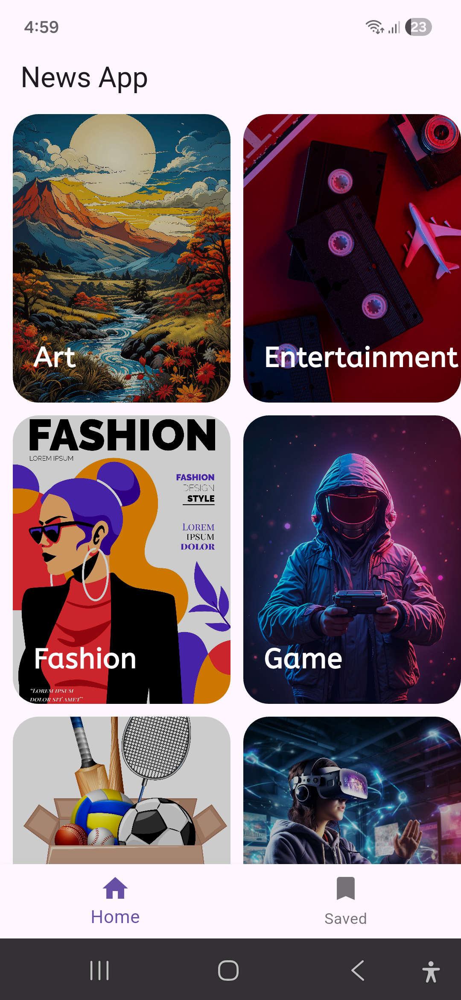

# 📰 News App (Flutter)

A modern **Flutter News Application** that fetches real-time news using the **NewsAPI**.  
Users can browse news by category, read full articles, and save articles for later reading.

---

## 📱 App Features

- ✅ Latest news from NewsAPI
- ✅ Category-wise news (Technology, Sports, Entertainment, etc.)
- ✅ Detailed article view
- ✅ Save / Bookmark news articles
- ✅ Clean & modern UI
- ✅ Fast image loading with cache support

---
## 📱 App UI Preview

### 🏠 Home Screen

---

### 📂 Category Screen

---

### 📰 Article Detail Screen

---

### ⭐ Saved News Screen

---

## 🛠 Tech Stack

- **Flutter (Dart)**
- **Provider** – State Management
- **NewsAPI** – News data source
- **Hive** – Local storage (Saved Articles)
- **Cached Network Image** – Image caching
- **Google Fonts**
- **URL Launcher**

---

## 🔑 API Used

**NewsAPI.org**

Get your free API key from:  
👉 https://newsapi.org/

---

